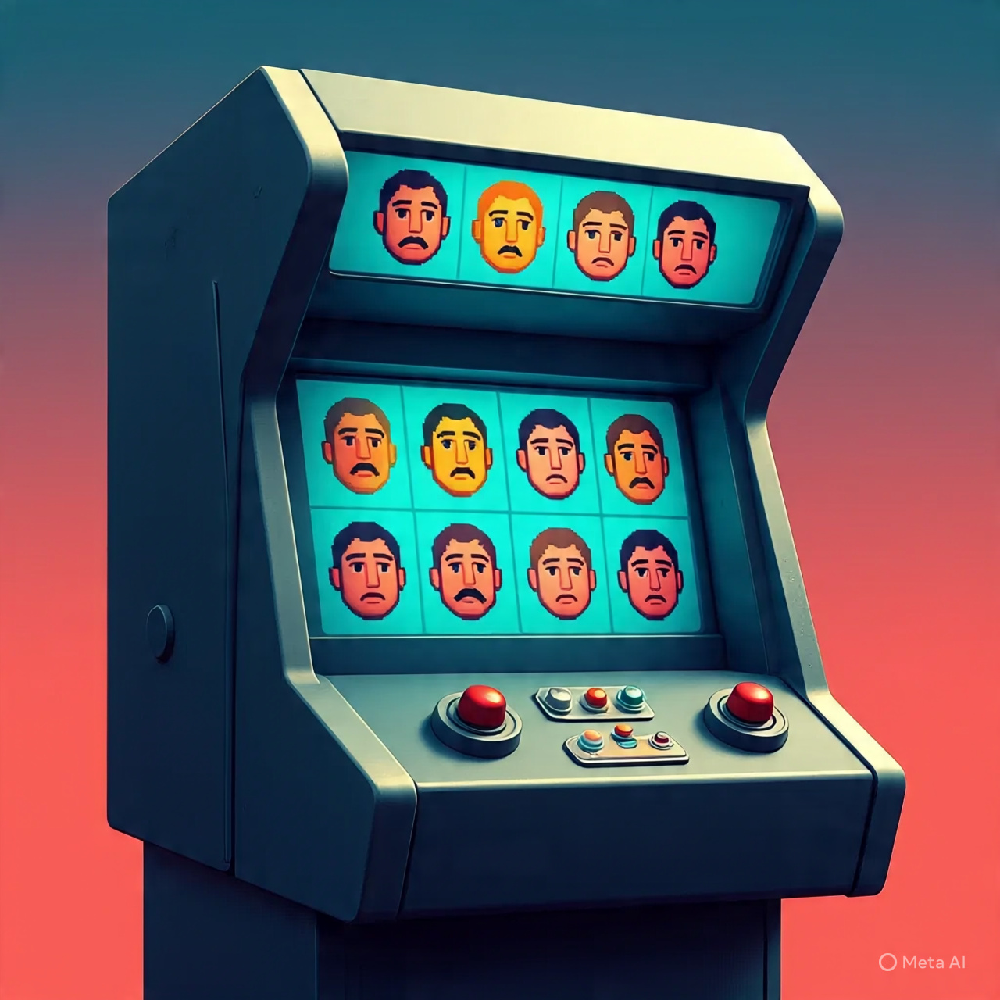

# Deep Learning Project

!!! The repository is still a work in progress !!!

Hi myself Rohan, Im a 3rd year BSc computer student at RV University

The DL Projects Repository is a curated collection of machine learning projects which is:
1. Facial Emotion Recognition

This project is done using IDE Google Colab and uploaded the file to Github
